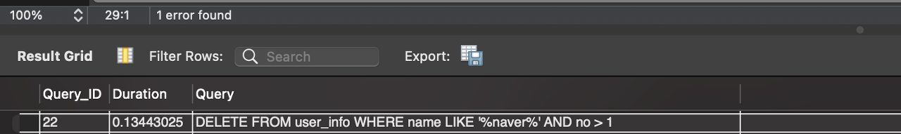
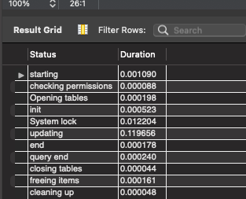

### MySQL 성능 측정

`1. SET profiling=1;`

`2. DELETE FROM user_info WHERE name LIKE '%naver%' AND no > 1;;`

`3. SHOW profiles`

`4. SHOW profile FOR QUERY 22;`

### InnoDB

- MySQL의 스토리지 엔진중 하나
- MySQL 8.0의 기본 스토리지 엔진
- Transaction 기능 내장
- Buffer Pool 내장
  - 디스크 상의 파일, 인덱스 정보를 메모리에 캐시 하기 위한 공간
  - 변경된 데이터를 모아서 처리하기 때문에 디스크 I/O 횟수를 줄일 수 있다

### MySQL 쓰레드

- MySQL은 프로세스가 아닌 쓰레드 기반으로 동작한다.
  - Foreground Thread // User Session
  - Background Thread // 내부 적인 처리 목적

#### Reference
- https://blog.ex-em.com/1681